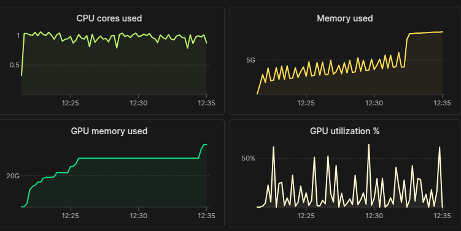
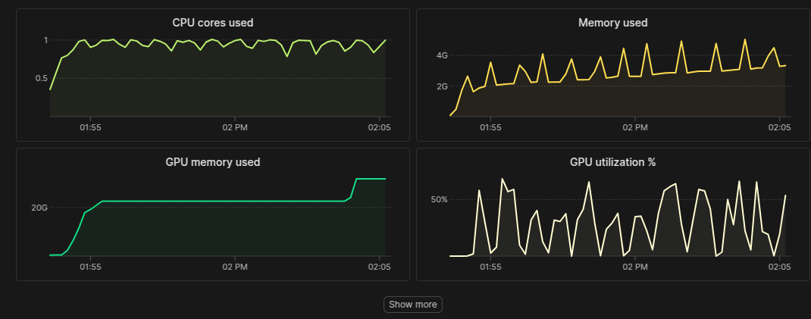
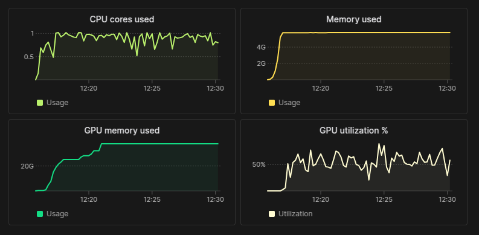

# Overview

This is a Modal port of the inference functionality of
[DiffDock](https://github.com/gcorso/DiffDock), a diffusion model that predicts
conformations of protein-ligand pairs, given the individual protein and ligand
structures in `.pdb` format.  In the context of virtual screening, there may be on
the order of billions of such pairs to test.  

Both kinds of screenings are used in industry - either searching for potential
ligands that bind a protein of interest, or testing whether a given ligand binds
other proteins.  The user may specify a set of protein-ligand pairs in the input as
described below to perform either of these kinds of screens.

# Quick Start 

```bash
git clone https://github.com/hrbigelow/DiffDock.git
git checkout modal-port

# one-time endpoints for preparation
# one volume stores all persistent data (including prediction results)
export VOLUME_NAME=diffdock-vol
modal volume create $VOLUME_NAME
modal volume put $VOLUME_NAME diffdock-repo/data/dockgen /data/
modal volume put $VOLUME_NAME diffdock-repo/default_inference_args.yaml /
modal run app.py::download_models
modal run app.py::build_caches

# run the model (molecular docking of a ligand against a protein)
# batch-size is the number of protein-ligand pairs run for one method call 
modal run app.py --inputs-json diffdock-repo/data/dockgen.json --batch-size 10  
```

NOTES: 

during `build_caches` there is a warning:

    /root/diffdock/utils/so3.py:67: RuntimeWarning: invalid value encountered in sqrt
      _exp_score_norms = np.sqrt(np.sum(_score_norms**2 * _pdf_vals, axis=1) / np.sum(_pdf_vals, axis=1) / np.pi)

I have not looked into this - it is present in the original work.  The prediction can
proceed in spite of it.

Also, the first time you run the main entrypoint, you will see two additional models
being downloaded, with the lines (duplicated by app.py::CONCURRENCY_LIMIT)

    Downloading: "https://dl.fbaipublicfiles.com/fair-esm/models/esm2_t33_650M_UR50D.pt" to /app/cache/hub/checkpoints/esm2_t33_650M_UR50D.pt
    Downloading: "https://dl.fbaipublicfiles.com/fair-esm/models/esm2_t33_650M_UR50D.pt" to /app/cache/hub/checkpoints/esm2_t33_650M_UR50D.pt
    Downloading: "https://dl.fbaipublicfiles.com/fair-esm/regression/esm2_t33_650M_UR50D-contact-regression.pt" to /app/cache/hub/checkpoints/esm2_t33_650M_UR50D-contact-regression.pt
    Downloading: "https://dl.fbaipublicfiles.com/fair-esm/regression/esm2_t33_650M_UR50D-contact-regression.pt" to /app/cache/hub/checkpoints/esm2_t33_650M_UR50D-contact-regression.pt

This occurs in
[inference_utils.py](./diffdock-repo/src/diffdock/utils/inference_utils.py#L132) and
should be surfaced to the `download_models` preparation step, but I did not get to
it.  This is obviously pretty bad (technically a race condition), but somehow it
doesn't seem to produce corrupted downloaded files.

## Initial preparation of DiffDock repo

### Convert DiffDock into a library package
  - change all absolute imports to relative
  - move code into `src/diffdock`
  - add pyproject.toml
  - move from argparse -> fire + plain kwargs main function

### Upgrade to CUDA 12.1 + torch 2.4.0
  - fix broken import fair-esm[esmfold] (use --no-deps)
  - use `-f https://data.pyg.org/whl/torch-2.4.0+cu121.html` for torch-scatter etc.

### Refactor to solve memory leak

I refactored inference.py, utils/inference_utils.py (see section below detailing
these experiments)

## The main Modal app.py

I adopted advice from Charles on how to minimize image rebuilds and manage
hyperparameter and other inputs, and structure the overall project.

  - used `pip_install_from_pyproject` with DiffDock `pyproject.toml`
  - used `add_local_dir` to add the DiffDock source directory
  - used `add_local_file` to add `data/hps.json` hyperparams file
  - `TORCH_HOME` env is used by Pytorch to cache downloading of intermediate models
  - moved DiffDock repo code into subdirectory `diffdock-repo`

# Input data

Input data defining each protein-ligand docking problem are given for example in the
`diffdock-repo/data/dockgen` directory, consisting of a list of subdirectories. For
convenience, I downloaded, cleaned, and extracted the main structure for the [DockGen
dataset](https://zenodo.org/records/10656052) and added it to this repo in
`data/dockgen`, for example:

```bash
(.venv) henry@henry-gs65:diffdock-repo$ tree data/dockgen | head -n 15
data/dockgen
├── 1dgb_1_NDP_1
│   ├── 1dgb_1_NDP_0_ligand.pdb
│   ├── 1dgb_1_NDP_1_ligand.pdb
│   └── 1dgb_1_NDP_1_protein_processed.pdb
├── 1dgf_1_NDP_0
│   ├── 1dgf_1_NDP_0_ligand.pdb
│   ├── 1dgf_1_NDP_0_protein_processed.pdb
│   └── 1dgf_1_NDP_1_ligand.pdb
├── 1dgg_1_NDP_0
│   ├── 1dgg_1_NDP_0_ligand.pdb
│   ├── 1dgg_1_NDP_0_protein_processed.pdb
│   └── 1dgg_1_NDP_1_ligand.pdb
```

Each subdirectory, for example `1dgb_1_NDP_1` contains one protein and at least one
ligand.  Together, this defines one or more protein-ligand pairs as an individual
docking problem.  Each problem will be sub-indexed as `<subdir>_0`, `<subdir>_1` etc,
for example:  `1dgb_1_NDP_1_0` and `1dgb_1_NDP_1_1`.

Admittedly, this is a clunky way to construct a virtual screening problem defining a
set of protein-ligand pairs.  But, in the interest of time, I simply followed the
structure of the original dataset.  For others, please see
[here](https://github.com/gcorso/DiffDock?tab=readme-ov-file#datasets).

# Inputs file

The inputs file is given in a JSON format as in `diffdock-repo/data/dockgen.json`
produced by:

    python -m diffdock.prepare make_input SOURCE_ROOT_PATH DEST_REL_PATH OUT_FILE
        optional flags:        --protein_suffix | --ligand_suffix

    python -m diffdock.prepare make_input \
        data/dockgen \
        data/dockgen \
        data/dockgen.json \
        --protein_suffix _protein_processed.pdb \
        --ligand_suffix _ligand.pdb

The produced file contains a JSON array with one object per problem, for example:

```json
[
  {
    "complex_name": "4i4i_1_PEP_2_0",
    "protein_path": "data/dockgen/4i4i_1_PEP_2/4i4i_1_PEP_2_protein_processed.pdb",
    "ligand_description": "data/dockgen/4i4i_1_PEP_2/4i4i_1_PEP_2_ligand.pdb"
  },
  {
    "complex_name": "4i4i_1_PEP_2_1",
    "protein_path": "data/dockgen/4i4i_1_PEP_2/4i4i_1_PEP_2_protein_processed.pdb",
    "ligand_description": "data/dockgen/4i4i_1_PEP_2/4i4i_1_PEP_0_ligand.pdb"
  },
  {
    "complex_name": "4i4i_1_PEP_2_2",
    "protein_path": "data/dockgen/4i4i_1_PEP_2/4i4i_1_PEP_2_protein_processed.pdb",
    "ligand_description": "data/dockgen/4i4i_1_PEP_2/4i4i_1_PEP_1_ligand.pdb"
  },

```

Importantly, the paths shown in this file refer to the DEST_REL_PATH, which is the
full path on the volume.  It is called DEST_REL_PATH since the full volume paths
become relative once mounted.  In this case, volume path `/data/dockgen` becomes
`/app/data/dockgen` inside the container.


# Results

For each input item in `data/dockgen.json`, a corresponding entry is written to 
`out_dir` as specified in `diffdock-repo/data/hps.json` in a subdirectory named with
`complex_name` field.  Conceptually, DiffDock is using a diffusion model to define a
posterior distribution over protein-ligand conformation space, and the reverse
diffusion process produces a sample from this distribution.  DiffDock will produce up
to `samples_per_complex` (default 10) samples (occasionally one may fail) and store
them in [SDF](https://lifechemicals.com/order-and-supply/how-to-work-with-sd-files)
format, with a confidence measure (higher is better) in the name of the file, for example:


```
results
├── 1dgb_1_NDP_1_0
│   ├── rank1.sdf
│   ├── rank1_confidence-2.75.sdf
│   ├── rank2_confidence-2.78.sdf
│   ├── rank3_confidence-2.83.sdf
│   └── rank4_confidence-3.06.sdf 

```

The confidence may be negative (as in the example above).

# TODO and curiosities

There are several kinds of non-fatal warnings that appear during the runs, and I
didn't have time to look into them.

Also, the original code provides a file called `default_inference_args.yaml`.
Despite the name, they actually use this as overrides, not defaults.  I left it
as-is, but it probably should be looked into.  In general, I didn't have time to grok
all of the parameters or figure out how one might set them for different inputs.

The setup step `build_caches` (see Quick Start) takes ~10 minutes.  It computes a few
4M element tensors and saves them, but does so very inefficiently, in
[so3.py](./diffdock-repo/src/diffdock/utils/so3.py).  I had originally implemented a
more efficient version that runs in ~20 seconds, but there were slight numerical
differences in one of the tensors, see
[so3_new.py](./diffdock-repo/src/diffdock/utils/so3_new.py).  For now I just left it
in original form.

## Solving the memory leak

At the first large-scale run (`--inputs data/dockgen.json`, `concurrency_limit=10`) 
there is apparently a gradual CPU memory leak (and then something more sudden):

</img>

Next was to add batched dispatch.  Each invocation of 

</img>

Memory leak

```
>>> for batch in batched[:10]:
...     inference.main(**hps, **batch)
...     usage = resource.getrusage(resource.RUSAGE_SELF)
...     print(usage.ru_maxrss)
...

# shows:
11521272
11612920
11736568
11821816
11914492
11987964
12096764

sizes = [11521272, 11612920, 11736568, 11821816, 11914492, 11987964, 12096764]
>>> [s2 - s1 for s1, s2 in zip(sizes[:-1], sizes[1:])]
[91648, 123648, 85248, 92676, 73472, 108800]
```

### Changes to DiffDock code

I made two major changes to DiffDock code `inference.py` and
`utils/inference_utils.py`.  Both involved separating model instantiation +
checkpoint loading from model forward call code.  

instantiated models are now held in
`inference.py::Inference` and
`inference_utils.py::InferenceDataset`.  And, the code which prepares the models for
specific protein-ligand inputs is in `inference.py::Inference.main` and
`inference_utils::InferenceDataset.initialize`.

Secondly, I ported `app.py` to now use a `app.cls()`.  Here, instantiation of
`Inference()` class is done in `@modal.enter` function, and the `main` call in the
`@modal.method` function.  The leak is now solved:

</img>

